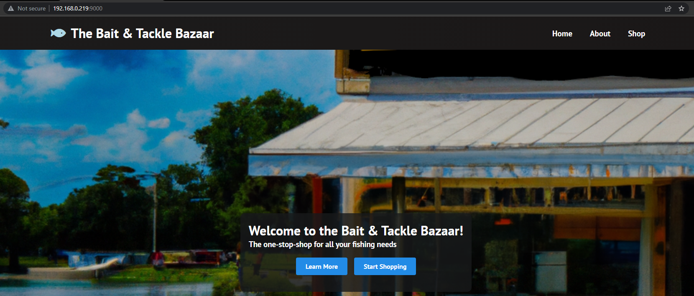

# Task 2 - Proxy Implementation Walkthrough

If you perform a `docker ps -a` command on your machine, you'll notice that there is a container called "proxy". 

**INSERT DOCKER PS IMAGE HERE**

Now, for this challenge, we have created the `nginx.conf` configuration on the host machine and have mounted this file into the proxy container (or machine if you'd like to think of it that way) to be used. 

This configuration can be found in the **FIND THE LOCATION ON THE HOST MACHINE WHEN DEPLOYED.**
The only thing that you need to do is update this file with some specific information and then restart the Docker container (you could also manually reload the nginx config within the container, but it's easier to restart the whole container.)

**INSERT NGINX CONF IN AN LS COMMAND**


If you look at the **CONFIRM THAT A NETWORK DIAGRAM EXISTS FOR THIS** network diagram, then you'll notice that this nginx proxy container is on the same docker network as the website container. One neat feature about Docker and docker networks is that it supports DNS. In this case, the hostname of the nginx container is proxy and the hostname of the website container is "website". And so, this makes the task much simpler as you don't need the IP address.

**HIGHLIGHT THE WEB CONTAINER HOSTNAME**


## Modifying the nginx.conf file
Using the sample provided in the briefing, we simply only need to change the target address in the `proxy_pass` call to match the **hostname** of the web container.

```
events {}

http {
  server {
    listen 9000;
    server_name teamX.umlcyber.club;

    location / {
      proxy_pass http://web-site:3000/;
    }
  }
}
```


## Restarting the docker container
After you updated the file and saved it, you can now restart the `proxy` container with the following command: `docker restart proxy`. This will make the proxy take the effects of the updates that you just made and there will now be route to the web container.


## Confirmation
You can confirm this in two ways.
1. Look at the scoreboard to see if your check is green.
2. You can use a web browser to navigate to your proxy's IP address. So for example, let's assume your proxy machine's IP address is 192.168.0.219 and the port we want to have this accessible is 9000. You can navigate (within a web browser) to http://192.168.0.219:9000. This will be sent to the proxy since it's listening on that port and the proxy pass directive will then forward this request to the web server container using its hostname.

You will have the following output:



Your website should be available now through http://teamX.umlcyber.club; where X is your team number.


Congratulations, you now have a route from the outside world to the website via a proxy that you set up!