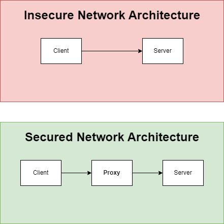

# Task 2 - Proxy Implementation
Good job on finding out the vulnerability. We're shocked that an attacker can get into our website machine just by listening for the username and password. This is clearly a serious vulnerability that cannot be swept under the rug. Something must be done.

So now, we have a plan that we'd like you to implement. The first step will be to implement a proxy on the network that the website can hide behind. 

This is the general idea of what a proxy is and what we're looking for:

The idea is that you don't want clients to access the website directly via the web server's IP address, but you want them to access it through the proxy's IP and then the proxy will handle the redirection. We don't want to remove the original access route just yet as one misconfiguration can render the system unreachable. And so the objective of this task is to add a route to the website server using the proxy through the port 80.

**Read the briefing provided before beginning your work.**

## **Expected Outcome**
1. The website is accessible using the IP address of the proxy server through port 80. The URL is going to be http://teamX.umlcyber.club. Where X is your team number.

