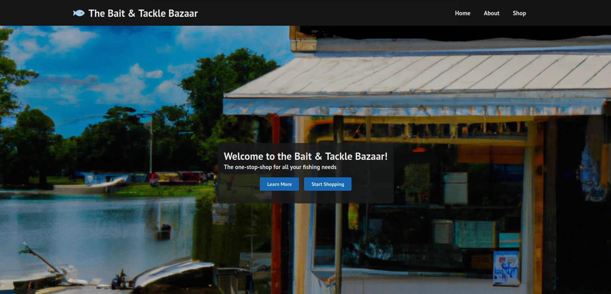

# Bait and Tackle Bazzar
## How to use
The containers can be build with the "build" script, run with the "run" script, and stopped with the "stop" script.

They spin up a reactJS app, a posgresql database, and an API to connect the two.

The reactJS is on port 3000, the API is on port 3001, and the database is on port 5432.

The run script also initializes the postgresql database.

I believe Matt has uploaded them to dockerhub, and Chris added a docker-compose file.

## Tasks completed:
Modified the [UML Cyber Security Website](https://github.com/UML-Cyber-Security/UML_Cyberclub_Site) to be a "Bait & Tackle Bazaar"

Hero Section with a Dalle-2 image: 

Changes from the original UML cyber sec site:

Changed Home & About pages to reflect the new content (of being a fish store)

Added a "shop" subdomain which is accessible in the NavBar.

Added an "admin" subdomain which is not accessible in the NavBar, so the students can block access to it. 

The admin subdomain is now hooked up to the postgresql database via the NodeJS express / node-postgress thing. This is not a secure way to initialize the database, but it is initialized from an init.sql file.

TODO:
The shop page should be fleshed out with images

The XSS on the shop page seems to exist, but I can't figure out how to get it to execute. The <script> is clearly in the page, as can be seen from inspect element. 

Make the admin page vulnerable to XSS
  
Enhance the privileges of the admin user, it currently only lets you view a "Welcome to the Admin Page".

