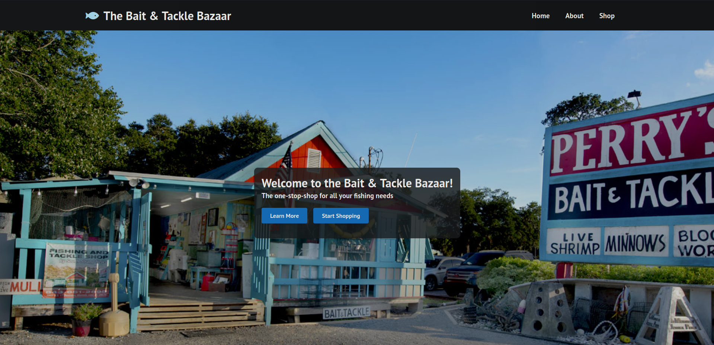

# Don't ask questions, work in progress
## How to use
The containers can be build with the "build" script, run with the "run" script, and stopped with the "stop" script.

They spin up a reactJS app, a posgresql database, and an API to connect the two.

The run script also initializes the postgresql database.

## Tasks completed:
Modified the [UML Cyber Security Website](https://github.com/UML-Cyber-Security/UML_Cyberclub_Site) to be a "Bait & Tackle Bazaar"

Original image [source](https://perrysbaitshop.com/images/Perrys-Bait-and-Tackle.jpg)

I will use Dalle-2 to make an original image once my credits refill

Completed:
Changed Home & About pages to reflect the new content

Added a "shop" subdomain which is accessible in the NavBar.

Added an "admin" subdomain which is not accessible in the NavBar, so the students can block access to it. 

The admin subdomain is now hooked up to the postgresql database via the NodeJS express / node-postgress thing.

TODO:
Document :(

Add products & images to the "shop" page, and make it vulnerable to XSS

Confirm the admin page is vulnerable to SQL injection

Improve the styling of the admin and shop pages (center them, add spacing, etc.)

Make "build & run" scripts for the three docker files. Also the APIServer is looking for a hardcoded postgresql IP address, I will fix that.
